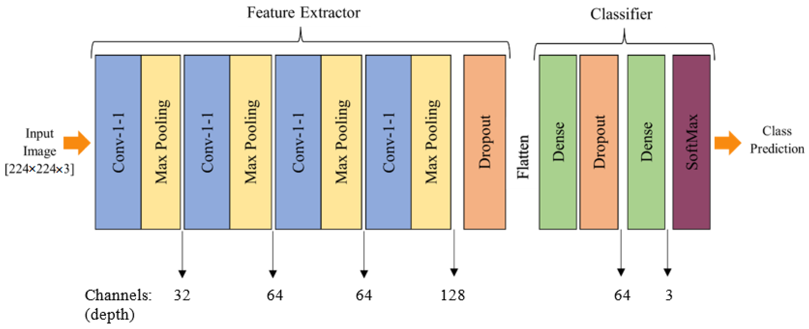
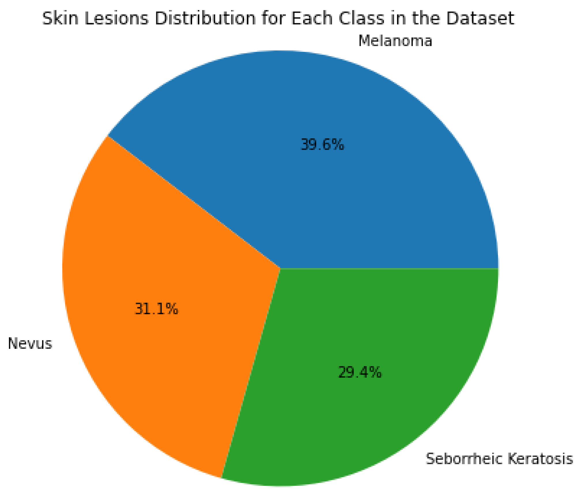

# SkinLesNet: Classification of Skin Lesions and Detection of Melanoma Cancer Using a Novel Multi-Layer Deep Convolutional Neural Network

<p align="left">
  <a href="https://www.mdpi.com/2072-6694/16/1" target="_blank" rel="noopener noreferrer"></a>
  <a href="https://doi.org/10.3390/cancers16010108" target="_blank" rel="noopener noreferrer"></a>
  <a href="https://github.com/azeemchaudharyg/SkinLesNet/blob/main/notebooks/SkinLesNet_Project.ipynb" target="_blank" rel="noopener noreferrer"></a>
  <a href="#" target="_blank" rel="noopener noreferrer"></a>
</p>

Official repository accompanying the publication: **"SkinLesNet: Classification of Skin Lesions and Detection of Melanoma Cancer Using a Novel Multi-Layer Deep Convolutional Neural Network"**

**Authors:** Muhammad Azeem, Kaveh Kiani, Taha Mansouri, and Nathan Topping

**Institution:** University of Salford, Manchester, England, UK.  

---

## Abstract

Skin cancer is a widespread disease that typically develops on the skin due to frequent exposure to sunlight. Although cancer can appear on any part of the human body, skin cancer accounts for a significant proportion of all new cancer diagnoses worldwide. There are substantial obstacles to the precise diagnosis and classification of skin lesions because of morphological variety and indistinguishable characteristics across skin malignancies. Recently, deep learning models have been used in the field of image-based skin-lesion diagnosis and have demonstrated diagnostic efficiency on par with that of dermatologists. To increase classification efficiency and accuracy for skin lesions, a cutting-edge multi-layer deep convolutional neural network termed SkinLesNet was built in this study. The dataset used in this study was extracted from the PAD-UFES-20 dataset and was augmented. The PAD-UFES-20-Modified dataset includes three common forms of skin lesions: seborrheic keratosis, nevus, and melanoma. To comprehensively assess SkinLesNet’s performance, its evaluation was expanded beyond the PAD-UFES-20-Modified dataset. Two additional datasets, HAM10000 and ISIC2017, were included, and SkinLesNet was compared to the widely used ResNet50 and VGG16 models. This broader evaluation confirmed SkinLesNet’s effectiveness, as it consistently outperformed both benchmarks across all datasets.

---

## Key Contributions
* **SkinLesNet Architecture:** Implements an advanced, multi-layer deep CNN architecture characterized by deep filter stacking, non-linear activation sequences, and structured pooling layers optimized for malignant pattern extraction.
* **Granular Lesion Categorization:** Moves beyond simple binary diagnostic setups to support highly sensitive, multi-class skin lesion categorization (including Melanoma, Basal Cell Carcinoma, and benign variations).
* **Robust Dermoscopic Assessment:** Validated across robust dermoscopic and smartphone-collected datasets, confirming highly stable diagnostic generalizability despite significant noise, illumination shifts, and imaging artifacts.
* **Optimized Clinical Footprint:** Engineers structural constraint balances to preserve micro-edge cellular boundaries while optimizing resource consumption for practical point-of-care deployment.

---

## Technical Overview: The SkinLesNet Model

The processing engine behind **SkinLesNet** transforms raw dermoscopic input matrices into discrete clinical classifications using a sequence of highly structured optimization stages:

1. **Input Map Acquisition:** Standardizing dermoscopic inputs to uniform dimensions to mitigate capture variations.
2. **Multi-Layer Convolutional Streams:** Iteratively stacking deep convolutional groups to map localized lesion edges, pigmentation boundaries, and global morphological contours.
3. **Non-Linear Operations & Batch Control:** Applying optimized ReLU functions and synchronized Batch Normalization tiers to sustain fast training convergence without experiencing overfitting or internal covariate shifts.
4. **Spatial Downsampling & Dense Classification:** Deploying MaxPooling matrices to aggregate feature hierarchies before passing the flattened structural vectors to fully connected dense layers and a softmax output classifier.

<p align="center">
  <br>
  <em>Proposed multi-layer deep CNN model architecture to classify different skin lesion categories.</em>
</p>

---

## Installation & Setup

We recommend managing project environment variables using Anaconda. The repository is configured and validated for Python 3.7+ running TensorFlow with a Keras backend.

```bash
conda create -n skinlesnet python=3.7 -y
conda activate skinlesnet
```
```
pip install tensorflow==2.4.1 keras==2.4.3
pip install scikit-learn pandas numpy matplotlib opencv-python
```

---

## Datasets
The research utilizes a modified **PAD-UFES-20** dataset containing clinical images and patient records from Brazil, which inherently presents realistic challenges like varying resolutions, sizes, and lighting conditions.

**Pre-processing Standards:** To address the critical clinical risk of melanoma misclassification, 1,314 skin lesion images were standardized to 224 x 224 pixels and partitioned into distinct training and testing cohorts.

**Data Augmentation:** To mitigate severe class imbalances and data limitations, geometric data augmentation (random flips, rotations, and translations) was applied, expanding the final balanced evaluation pool to 520 melanoma, 408 nevus, and 386 seborrheic keratosis images.

<p align="center">
  <br>
  <em>The pie chart highlights the distribution of different skin-lesion classes within the PAD-UFES-20-Modified dataset, and shows that in this dataset there is no significant class imbalance.</em>
</p>

To further validate generalizability, the primary study was augmented with two widely benchmarked, public dermatoscopic databases: **HAM10000** and **ISIC2017**.

The HAM10000 repository provides 10,015 high-resolution dermatoscopic images tracking critical lesion variations, including basal-cell carcinoma, squamous-cell carcinoma, seborrheic keratosis, melanoma, and nevi. ISIC2017 Clinical Target: Backed by the International Skin Imaging Collaboration, the ISIC2017 dataset offers a massive multi-class registry with an explicit emphasis on the structural traits of malignant melanoma to advance early clinical detection.

---

## Experimental Results & Quantitative Comparisons

The SkinLesNet model demonstrates superior performance compared to traditional fine-tuned baseline architectures (VGG16 and ResNet50) across all target test datasets. 

### 1. Performance on PAD-UFES-20-Modified Test Dataset
This table tracks the performance breakdown on our primary smartphone-acquired clinical dataset.

<div align="center">

| Performance Metrics | Fine-Tuned VGG16 | Fine-Tuned ResNet50 | **Proposed SkinLesNet** |
| :--- | :---: | :---: | :---: |
| **Accuracy** | 79% | 82% | **96%** |
| **Precision** | 80% | 85% | **97%** |
| **Recall** | 75% | 75% | **92%** |
| **F1-Score** | 72% | 75% | **92%** |

</div>

### 2. Performance on HAM10000 Test Dataset
This table illustrates evaluation metrics on the large-scale, multi-class dermatoscopic repository.

<div align="center">

| Performance Metrics | Fine-Tuned VGG16 | Fine-Tuned ResNet50 | **Proposed SkinLesNet** |
| :--- | :---: | :---: | :---: |
| **Accuracy** | 75% | 80% | **90%** |
| **Precision** | 75% | 80% | **89%** |
| **Recall** | 70% | 72% | **87%** |
| **F1-Score** | 70% | 71% | **85%** |

</div>

### 3. Performance on ISIC2017 Test Dataset
This table shows verification data on the highly complex global diagnostic benchmark from the International Skin Imaging Collaboration.

<div align="center">

| Performance Metrics | Fine-Tuned VGG16 | Fine-Tuned ResNet50 | **Proposed SkinLesNet** |
| :--- | :---: | :---: | :---: |
| **Accuracy** | 70% | 75% | **92%** |
| **Precision** | 70% | 75% | **80%** |
| **Recall** | 70% | 65% | **82%** |
| **F1-Score** | 72% | 70% | **75%** |

</div>

---

## Citation
If you find our research useful in your work, please cite our paper:

```bibtex
@article{azeem2024skinlesnet,
  title={SkinLesNet: Classification of Skin Lesions and Detection of Melanoma Cancer Using a Novel Multi-Layer Deep Convolutional Neural Network},
  author={Azeem, Muhammad and Kiani, Khurram Aurrangzeb and Mansouri, Tarik and Topping, Nicholas},
  journal={Cancers},
  volume={16},
  number={1},
  pages={108},
  year={2024},
  publisher={MDPI},
  doi={10.3390/cancers16010108}
}

